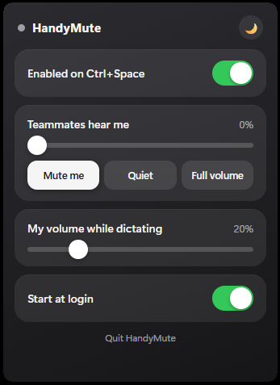

# HandyMute

A tiny Windows tray app for people who dictate with [Handy](https://github.com/cjpais/Handy) (push-to-talk speech-to-text on **Ctrl+Space**) while in a call.

<p align="center">
  
</p>

When you hold Ctrl+Space to dictate, you don't want your teammates on Teams/Zoom/Discord to hear you talking to your computer — but Handy still needs the mic. HandyMute solves that:

**While Ctrl+Space is held:**
- 🔇 Your teammates hear **silence** (or a quiet level you choose) — Handy still gets full mic
- 🔉 **All your other audio dims** (the call, music, a YouTube video) so you can hear yourself dictate
- ✅ Everything **restores instantly** when you let go

It lives in the system tray as a microphone icon that **glows green while you're talking**, with an iPhone-style Control Center panel for the settings.

> **Status:** Windows 10/11 (x64) only for now. Linux (PipeWire) is on the roadmap — see [Roadmap](#roadmap).

---

## Install

Download **`HandyMute-Setup.exe`** from the [Releases](../../releases) page and run it. The installer:

1. Installs HandyMute to `C:\Program Files\HandyMute`
2. Downloads & installs **[VB-CABLE](https://vb-audio.com/Cable/)** if you don't already have it (a free virtual audio device — see [How it works](#how-it-works))
3. **Auto-configures the microphone routing for you** (no Sound-settings fiddling)
4. Enables start-at-login and adds a tray icon

### The one manual step

The installer can't set your meeting app's microphone for you (apps store that internally). After install, set it once:

| App | Where | Set to |
|---|---|---|
| Microsoft Teams | Settings → Devices → Microphone | **CABLE Output (VB-Audio Virtual Cable)** |
| Zoom | Settings → Audio → Microphone | **CABLE Output (VB-Audio Virtual Cable)** |
| Discord | Settings → Voice & Video → Input Device | **CABLE Output (VB-Audio Virtual Cable)** |

Leave **Handy** (and any other dictation tool) on your **real microphone**.

---

## Usage

Hold **Ctrl+Space** to dictate, as usual. Click the tray microphone to open the Control Center:

- **Enabled** — master on/off (when off, Ctrl+Space passes straight through to Handy)
- **Teammates hear me at** — 0% (silent) up to 100%, with quick **Mute me / Quiet / Full volume** buttons
- **My volume while dictating** — how far all your output dims while held
- **Theme** — dark / light
- **Start at login**

---

## How it works

One physical mic can't feed Handy and your call app with opposite needs during the hold, so the two are separated with a virtual audio cable:

```
Physical mic ──┬─────────────────────────────────────────► Handy (your real mic — never touched)
               │
               └─►[Windows "Listen to this device"]─► CABLE Input ─► CABLE Output ─► Teams / Zoom / Discord
                                                          ▲
                                       attenuated while Ctrl+Space is held
```

- **Handy** reads your real microphone directly, so dictation always works.
- **Call apps** read **CABLE Output**.
- HandyMute continuously bridges your real mic into the cable (it sets up Windows' "Listen to this device" for you).
- While Ctrl+Space is held, it lowers the cable's volume (per-session, so VB-Cable can't ignore it) to the level you chose, and dims every output device. On release, it restores both.

The keyboard hook, the audio control, and the bridge setup are all done in-process; the only external piece is the VB-CABLE driver (a virtual sound card can't be created from user space).

> Why a cable at all? Windows' per-app *capture* mute isn't isolated — muting the call app's mic also muted Handy. The cable physically separates the two consumers. (On Linux, PipeWire *does* isolate per-app capture, so the Linux port won't need a cable.)

---

## Building from source

Requires **[Go](https://go.dev/dl/) 1.21+** on Windows.

```powershell
# tray app (silent) + console build (logs to a window, for debugging)
go build -trimpath -ldflags="-H windowsgui -s -w" -o dist\handymute.exe .\cmd\handymute
go build -trimpath -o dist\handymute-console.exe .\cmd\handymute
```

- The Windows manifest is compiled in via `cmd/handymute/rsrc.syso` (committed). To regenerate it after editing `cmd/handymute/app.manifest`:
  ```powershell
  go install github.com/akavel/rsrc@latest
  rsrc -manifest cmd\handymute\app.manifest -o cmd\handymute\rsrc.syso
  ```
- The Control Center UI is `cmd/handymute/controlcenter.html` (embedded). It renders in **WebView2** (the runtime ships with Windows 11; the [Evergreen runtime](https://developer.microsoft.com/microsoft-edge/webview2/) installs it on Windows 10).

### Building the installer

Install [Inno Setup 6](https://jrsoftware.org/isdl.php), then:

```powershell
& "$env:LOCALAPPDATA\Programs\Inno Setup 6\ISCC.exe" handymute.iss
# -> dist\HandyMute-Setup.exe
```

### Command-line flags

`handymute.exe` also supports (used by the installer/uninstaller):

| Flag | Action |
|---|---|
| `-install` / `-uninstall` | add / remove the start-at-login registry entry |
| `-setup-bridge` / `-remove-bridge` | enable / disable the mic→CABLE Input "Listen" pass-through (needs admin) |

---

## Roadmap

- **Linux (PipeWire):** per-app capture volume is isolated there, so no virtual cable needed — attenuate the call app's capture stream directly. (Wayland global-hotkey handling is the open question.)
- Optional click-away-to-dismiss for the panel
- Acrylic/blur background for the Control Center

Contributions welcome — the code is split into a shared core plus per-OS backends. See
[docs/PORTING.md](docs/PORTING.md) for the exact contract a new platform implements.

---

## License

[MIT](LICENSE). VB-CABLE is donationware by VB-Audio and is **not** bundled — the installer downloads it from the official site at install time. See [vb-audio.com/Cable](https://vb-audio.com/Cable/) for its terms.
